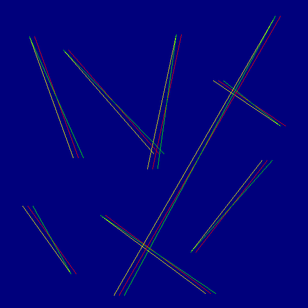

# Vector

The GUI (shown below) called "Drawing Plane" is also available plz email!

Common use cases: Drawing lines, interpolation, drawing polygons.

Vector can also be used in another program of mine, Tiles, to draw lines.

